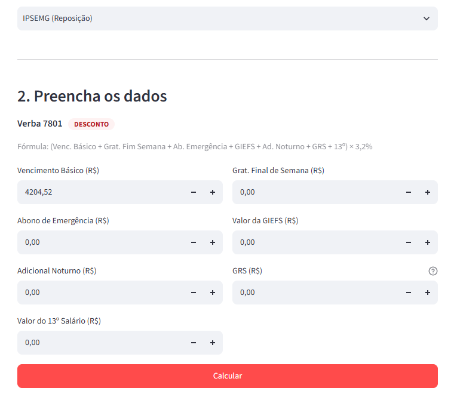

Leudmarlen Rubia Gusmao Figueiredo
verba desconto filho 21 a 39 anos - 9519
Bom dia! 
Corrigindo uma informação de verbas de dependentes do IPSEMG:
 
9519: IPSEMG-FIL MENOR 21A
9619: CONT.DEP-FILHO21 ATRASO
1419: RESTITUICAO DEPEND. FILHO MENOR 21 ANOS
 
6115: IPSEMG-FILHO 21 A 39
815: RESTITUICAO CONTR. DEPEND. 21 A 39 ANOS
8115: CONT.DEPEND.-FILHO 21 A 39 ANOS - ATRASO
 
6116: IPSEMG-DEPEND. 3,2%
816: RESTIT.CONTRIB. DEPEND. - 3,2%
8116: CONT. DEPEND. - 3,2% REM. - ATRASO
 
 
 
1. Contribuição do Servidor Titular
A cobrança sobre a remuneração do servidor respeita os seguintes parâmetros de mínimo e máximo:
Alíquota base: 3,2% do salário bruto.
Valor mínimo (Piso): R$ 60,00 (ninguém paga menos que isso, mesmo que a conta de 3,2% dê um valor menor).
Valor máximo (Teto): R$ 500,00 (limite máximo cobrado individualmente sobre o salário do titular). [1]
2. Valores Fixo por Dependentes (Filhos e Cônjuges)
A nova lei acabou com a isenção de filhos e passou a cobrar valores fixos mensais diretamente no contracheque:
Filhos menores de 21 anos: R$ 60,00 por dependente.
Filhos de 21 a 39 anos: R$ 90,00 por dependente.
Cônjuge ou companheiro(a): Passa a ter uma cobrança com teto individual próprio de até R$ 500,00, calculada de forma separada à do titular. [1]
3. Alíquota Adicional por Idade (Sênior)
Beneficiários que possuem idade mais avançada sofrem uma taxação extra para ajudar a cobrir os custos de saúde:
Usuários com 59 anos ou mais: É somada uma alíquota adicional de +1% sobre o salário bruto (totalizando 4,2% de desconto para essa faixa etária). [1]
🚫 Isenções Importantes mantidas na Lei
Renda Baixa: Titulares que recebem uma remuneração igual ou inferior a 2 salários mínimos ficam isentos do pagamento da alíquota adicional de 1% (idade) e da cobrança de filhos menores de 21 anos.
[1, 2]
Dependentes com deficiência: Filhos com deficiência ou portadores de doenças raras continuam mantendo regras diferenciadas de proteção/isenção. [1, 2]
Zema sanciona lei que altera regras de contribuições ao Ipsemg; veja o que muda | G1
Texto que torna o projeto lei foi publicado no Diário Oficial desta quinta-feira (9) e entra em vigor em abril.
 
Leudmarlen Rubia Gusmao Figueiredo
1. Contribuição do Servidor Titular A cobrança sobre a remuneração do servidor respeita os seguintes parâmetros de mínimo e máximo:  • Alíquota base: 3,2% do salário bruto. • Valor mínimo (Piso): R$…
Essas são as regras do IPSEMG, mandei aqui so pra vc ter uma noção, é bem chatinho cada servidor entra em uma situação especifica
 

 Leudmarlen Rubia Gusmao Figueiredo
Bom dia! Corrigindo uma informação de verbas de dependentes do IPSEMG:   9519: IPSEMG-FIL MENOR 21A 9619: CONT.DEP-FILHO21 ATRASO 1419: RESTITUICAO DEPEND. FILHO MENOR 21 ANOS   6115: IPSEMG-FILHO 2…
Leud, seguindo a lógica daquela tabela que você me mandou dos pares de verbas em atraso e reposição, quais pares dessas indicadas aí que entrariam? Ou entrariam as 3 de cada? 
 
 
1549	RESTIT. IPSEMG ASS.MEDICA - 13º SAL	7701	IPSEMG ASSIST. MED. 13º ATRASO
1411	RESTITUICAO IPSEMG ASSIST. MEDICA	7801	IPSEMG ASSIST. MED. ATRASO
E aquelas indicadas na tabela são outras ainda? Pergunto pois vi que os códigos são diferentes também 
 
13:55 Reunião iniciada

 
Joyce Andrade Miranda foi convidado para a reunião.

 
13:56 Reunião encerrada: 20s PresençaBaixar o relatório de presença

 
Antonio Marcel Sotero Dias de Oliveira
1549 RESTIT. IPSEMG ASS.MEDICA - 13º SAL 7701 IPSEMG ASSIST. MED. 13º ATRASO   1411 RESTITUICAO IPSEMG ASSIST. MEDICA 7801 IPSEMG ASSIST. MED. ATRASO    E aquelas indicadas na tabela são outras…
nem reparei kkkk, vou ver quais precisam incluir e ja te falo.
 
as do IPSEMG que estao naquela lista de verba é o que desconta só do servidor. Essas outras são descontos dos dependentes do servidor
 
precisamos que tenha essas: 
 
1419: RESTITUICAO DEPEND. FILHO MENOR 21 ANOS
9619: CONT.DEP-FILHO21 ATRASO
 
815: RESTITUICAO CONTR. DEPEND. 21 A 39 ANOS
8115: CONT.DEPEND.-FILHO 21 A 39 ANOS - ATRASO
 
816: RESTIT.CONTRIB. DEPEND. - 3,2%
8116: CONT. DEPEND. - 3,2% REM. - ATRASO
 
 
Leudmarlen Rubia Gusmao Figueiredo
as do IPSEMG que estao naquela lista de verba é o que desconta só do servidor. Essas outras são descontos dos dependentes do servidor
Entendi.... do jeito que fiz aqui apliquei essa fórmula p/ o desconto de Ipsemg de servidor 
 
 
 
 
 
A do 13o deixei como campo aberto porque fiquei na dúvida 
 
Eu acho que acabei misturando as fórmulas e apliquei nela a do IPSEMG 3,2% 
Antonio Marcel Sotero Dias de Oliveira
Entendi.... do jeito que fiz aqui apliquei essa fórmula p/ o desconto de Ipsemg de servidor   📷
 
 
Leudmarlen Rubia Gusmao Figueiredo
precisamos que tenha essas:   1419: RESTITUICAO DEPEND. FILHO MENOR 21 ANOS 9619: CONT.DEP-FILHO21 ATRASO   815: RESTITUICAO CONTR. DEPEND. 21 A 39 ANOS 8115: CONT.DEPEND.-FILHO 21 A 39 ANOS - ATRASO…
Vou implementá-las. Pode colocar como campo aberto e depois alinhamos as fórmulas? 
 
no caso a verba do decimo terceiro nao entra junto das demais verbas, pois tem a verba separada de decimo terceiro do ipsemg
Antonio Marcel Sotero Dias de Oliveira
Entendi.... do jeito que fiz aqui apliquei essa fórmula p/ o desconto de Ipsemg de servidor   📷 
 
Antonio Marcel Sotero Dias de Oliveira
A do 13o deixei como campo aberto porque fiquei na dúvida
essa verba, é 3,2% do 13º. giefs 13º e piso 13º se tiver (mas piso é a parte)
 
Beleza. Vou validar aqui 
 